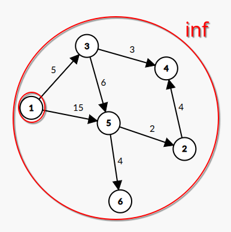
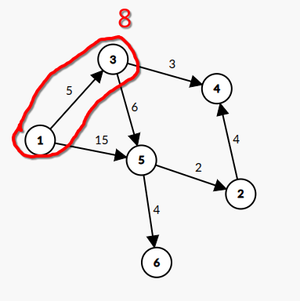
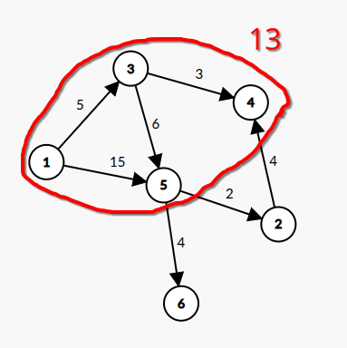
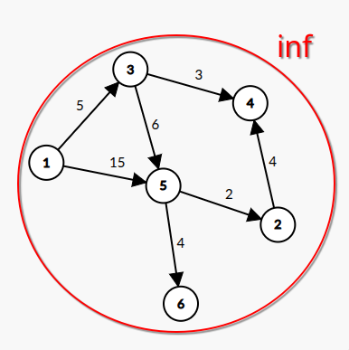
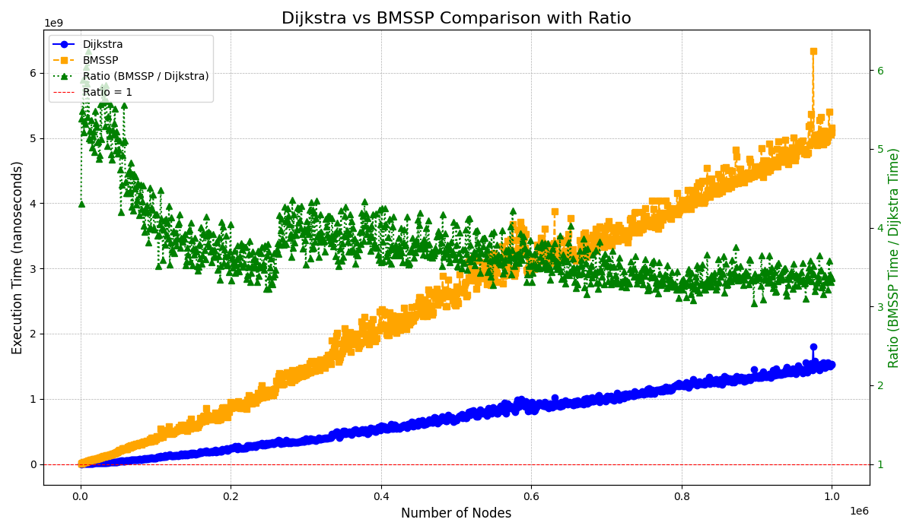

# Breaking the Sorting Barrier for Directed Single-Source Shortest Paths
Implementation, documentation, and experimentation of the **Bounded Multi-Source Shortest Path** (**BMSSP**) as an algorithm that solves the **Single Source Shortest Path** (**SSSP**) problem, comparing it to **Dijkstra**.

This repository uses the paper [Breaking the Sorting Barrier for Directed Single-Source Shortest Paths](https://arxiv.org/abs/2504.17033) as a basis for implementing and documenting **BMSSP** by solving the shortest path problem for a single source. Furthermore, an experimental comparison with **Dijkstra** is made to analyze whether the promised time barrier for **SSSP** is overcome.

## Introduction
Shortest path algorithms identify the shortest path between points in a graph. The shortest path refers to the sum of the edge weights (cost, time, or distance). This question is of paramount importance for various applications, and the efficiency with which the shortest path is found is crucial for the proper functioning of flow networks, which are applied to product transportation logistics, route selection in digital networks, and social media recommendation algorithms. The recently released **BMSSP** is an algorithm for identifying single-source shortest paths that breaks the **Dijkstra** time barrier, and the lack of implementations and documentation for it motivated this study. For this analysis, the group implemented the program in Java, documented its operation, and performed efficiency comparison tests with **Dijkstra**'s shortest path algorithm.

## Objective
The search for single-source shortest paths in directed graphs with non-negative weights is a central problem in computer science. In this context, **Dijkstra**'s algorithm has established itself as the standard method for solving the single-source shortest path problem due to its efficiency.
The traditional Dijkstra algorithm has a time complexity of $O(m\log n)$, where **n** is the number of nodes and **m** is the number of edges, which was considered the barrier for this type of problem. The article **Breaking the Sorting Barrier for Directed Single-Source Shortest Paths** introduces a new theoretical algorithm with a time complexity of $O(m\log^{2/3}n)$, breaking this barrier. However, the lack of concrete, documented implementations of this algorithm hinders its understanding and practical analysis, limiting access to the content by the academic and technical community.

Therefore, this project aims to implement the algorithm proposed in the referenced article, faithfully following its logic, data structures, and optimization strategies. To this end, the code will be written in Java, utilizing implementation and language optimizations whenever possible, without altering its complexity, allowing for validation of its functionality. Furthermore, comparative tests are performed between the algorithms using sparse graphs, since the difference in complexity is more prominent with a small **m** and with similar degrees between nodes, as the article assumes this configuration to satisfy the complexity.

# Theoretical Foundation

## General Idea of ​​the Algorithm

To understand the specifics of the algorithm, a more abstract understanding of how it works is first necessary, since it is uncommon for a shortest path algorithm to use a divide-and-conquer strategy.

The general idea is to divide the problem into small parts, based on distance bounds, until the part is small enough for a simple **Dijkstra** computation. Also, by construction, limiting a division good enough to reduce time complexity, in which there is not, as traditionally occurs, a complete ordering of the distances in a priority queue, but only an ordering between the parts, which makes it possible to break the barrier addressed by the article.

More specifically, a `bmssp` call receives an upper bound, the current recursion level, and the nodes already resolved. Among these nodes, those that reach unresolved nodes within the specified boundary, the so-called **pivots**, will be found, also solving for the distances of some nodes reached by them. With these pivots, a new call will be made to solve the problem for a smaller upper bound, until the recursion level indicates that this is trivial enough for **Dijkstra** to be used for the small bound. Thus, as nodes are completed for these smaller bounds, they can be used as pivots for the larger bounds, gradually solving the entire problem by selecting the pivots with the smallest distances, using the specialized `DQueue` structure.

Therefore, the function's return contains the newly completed nodes and the upper bound they reached, since for this strategy to work, it is necessary to ensure that, given the distances $b<B$, all paths with distances between **b** and **B** pass through a node with a distance of up to **b**, so each recursive call solves the problem for a given **b**, allowing the previous call to solve the nodes on the frontier **B** from these paths, achieving a more optimal solution.

Thus, the first call to `bmssp` contains an infinite upper bound, since it aims to solve all nodes, regardless of distance, and the only completed node is the origin, with zero distance.

Furthermore, it is important to highlight the algorithm's relationship with the priority queue. During its execution, **Dijkstra** needs to maintain the frontier, which is the set of vertices already discovered but not yet fully processed. This means that their provisional minimum distance from the origin is known, but the algorithm may not yet have fully explored neighboring vertices. These frontier vertices are stored in a priority queue, from which the next closest vertex is repeatedly extracted. The frontier in Dijkstra's algorithm can have up to n elements, where n is the number of vertices. Extracting one vertex at a time incurs an additional cost of $\log n$ per operation, and a total cost of $n\log n$.

BMSSP recursively reduces the size of the frontier under consideration by combining Dijkstra's algorithm and the Bellman-Ford algorithm to divide the problem, along with a strategically designed data structure that allows insertion and removal in groups, enabling this partial sorting. As a result, the total number of operations can be significantly reduced, leading to improvements in the algorithm's runtime and making it faster.

## Implementation

The algorithm's implementation is organized into three main methods: bmssp(), baseCase(), and findPivots. In addition, the `solve()` method was also developed, responsible for receiving the source node and the graph on which the algorithm will be executed. It initializes the necessary constants and data structures, sets the distances of each node to infinity (except for the zero distance from the source), and then calls the `bmssp()` method with the appropriate initial parameters. Regarding these constants, the article defines, for the division to function correctly, the constants $k=\left \lfloor{\log^{1/3}n}\right \rfloor$, $t=\left \lfloor{\log^{2/3}n}\right \rfloor$, and $level=\left \lceil{(\log n)/t}\right \rceil$. Furthermore, for the algorithm's return, a global structure is defined that stores, for all nodes, the shortest distance between the source and itself.

### BMSSP
The `bmssp()` method controls the algorithm's main recursion, dividing the overall problem into subproblems until the base case is reached, that is, when the recursion level reaches zero. This method initially receives three parameters. The first is the recursion level, used as a stopping condition. The second is a numerical value called the upper bound, which establishes the region in which the three methods will operate. For example, if the upper bound is 5, the methods will only modify nodes whose distance from the reference node is less than or equal to 5. Initially, this bound is set to infinity, ensuring that it is always greater than any finite distance. The third parameter consists of a set of nodes with known distances. This set, at the beginning of execution, contains only the source node—that is, the node from which the distances to all others will be calculated. The first operation performed by the method is to check whether the recursion level is zero. In this case, the problem is already sufficiently reduced, and the method returns to the call to `baseCase()`. Otherwise, the algorithm uses the `findPivots` method to identify the pivots of the current recursion, defined based on the already known nodes and the current upper bound. Next, the **DQueue** is initialized, a queue structure designed to optimally retrieve the **M** smallest elements in a single query, a so-called block. The structure is instantiated with two parameters: the current upper bound and the block size (**block size**), defined as $M=2^{(level-1)t}$. The use of (level-1) is because the removed blocks will be used in the next recursive call, the one at the lowest level. After initialization, all identified pivots are inserted into the **DQueue**, and the upper limit of completed nodes assumes the value of the smallest distance between the pivots (this would be the **b** used as the basis for **B**). Then, a new set, called **newCompleteNodes**, is defined to store the nodes whose distances in relation to the source node are determined during the execution of the main `bmssp()` loop. A maximum limit is also established for the size of this set, defined as $maxSize=k2^{t}$, to ensure that a single method call does not execute more than the limit defined by the division. From this point on, as long as the set size does not exceed this limit and the **DQueue** is not empty, the main loop of the algorithm is executed. This loop's operation can be described as follows:

1. From the **DQueue**, two pieces of information are extracted: the **M** smallest nodes already completed, called **prevNodes**, and **prevUpperBound**, corresponding to the limit between the elements that have been removed and those remaining in the queue.

2. Next, two new variables are defined, analogous to the previous ones: **currentNodes** and **currentUpperBound**. These values ​​correspond to the results of the next recursive call, performed at a reduced level, considering **prevNodes** and **prevUpperBound**. In this way, the problem is progressively reduced until the level reaches zero, at which point the base case is triggered with a single initial node. In all these scenarios, the return consists of the explicit **current** variables.

3. The new complete nodes are then incorporated into the **newCompleteNodes** set, while a new set, called **newNodeDists**, is created to store all nodes whose distance is between **currentUpperBound** and **prevUpperBound**. These values ​​are then simultaneously added to the **DQueue**, ensuring greater code execution efficiency. Next, a loop is initiated that iterates through all nodes in the **currentNodes** set, checking their edges. For each new node analyzed, the new path found to it is checked to see if it is shorter than the previously stored one. If so, this new value is updated. Furthermore, if the node meets the condition of belonging to the **newNodeDists** set, it and its distance are included in this set. If it is between **prevUpperBound** and **upperBound** (the upper bound passed as a method argument), the insertion of this single pair occurs immediately.

4. A loop is executed over the nodes in the **prevNodes** set, checking whether the node, with its distance, fits into the **newNodeDists** set, adding it if necessary.

5. The **newNodeDists** set is then added to the **DQueue** using the **batchPrepend** operation. This ensures greater efficiency compared to inserting multiple elements individually, as it is guaranteed that this set only contains pairs smaller than those already present in the structure. This completes an iteration of the main loop, which repeats until the limit number of nodes is reached or the structure is empty.

Finally, the smallest value between the **upperBound** received as a parameter at the beginning of the method and the **currentUpperBound** is defined to be returned as the upper bound that the method completed. Then, for each complete node returned by `findPivots()`, it checks whether its distance is less than this smallest **upperBound**. If so, the node is added to the **newCompleteNodes** set. Thus, the method's final return is composed of the smallest **upperBound** and the **newCompleteNodes** set.

### Base Case
When the recursion level reaches zero, `baseCase()` is triggered. This method receives an upper bound and a pivot as parameters, since the problem is already sufficiently reduced to contain only one origin, from which the distances to neighboring nodes will be calculated. Initially, the method defines a set of complete nodes (**completeNodes**) and a minimum priority queue, both containing only the pivot. Additionally, a new upper bound is established, corresponding to the pivot distance. Then, as long as the priority queue is not empty and the number of elements in **completeNodes** is less than $k + 1$, **baseCase()** executes a loop that:

1. Removes a node-distance pair from the priority queue and checks whether this value is not outdated, only continuing if it matches the smallest distance found. If not, the loop continues with this **currentNode** and **currentDist** pair.

2. Checks whether the distance to **currentNode** is greater than the new **upperBound**. If this condition is met, the upper bound is updated with the distance value.

3. Executes a loop over all edges connected to **currentNode**. For each node, the distance to it is calculated as the sum of the edge weight and the distance to **currentNode**. If the new distance is less than the previously known distance, it is updated and the node is added to the priority queue.
Thus, at the end of the loop, if the number of nodes in the completeNodes set is less than or equal to k, the method returns this set along with the upper bound received as a parameter at the beginning. Otherwise, only the nodes whose distance is less than the newly calculated upperbound are returned, along with this updated upper bound value. This is because, like `bmssp()`, `baseCase()` also has a limit on the number of computed nodes.

### Find Pivots
The `findPivots()` method is responsible for identifying the pivot nodes that will be used to partition the problem and reduce the recursion level. It receives as parameters an upper bound and an initial set of nodes, called **border**. The method has a main loop and defines three sets of nodes: the set of all completed nodes to be returned at the end of the method (**completeNodes**), the nodes completed in the previous iteration of the loop (**prevNodes**), and the nodes being completed in the current iteration of the loop (**currentNodes**). The sets **prevNodes** and **completeNodes** are initially populated with the **border** nodes, while **currentNodes** is empty. The algorithm executes k iterations of the following loop:

1. The method traverses all edges of the nodes in prevNodes. For each connected node, the new distance is calculated as the sum of the node's distance from prevNodes and the edge weight.

2. If the newly calculated distance is less than the previously known distance to the node, this value is updated. Furthermore, if the new distance is less than the upper bound, the node is added to the currentNodes set.

3. All nodes in the currentNodes set are added to the completeNodes set, and currentNodes becomes prevNodes. Furthermore, before the next iteration of the loop, it checks whether the size of the completeNodes set exceeds $k\cdot|border|$. If so, the method returns the entire border set as pivots, along with the completeNodes set.

After the loop completes, if the size of the **completeNodes** set is less than the limit, the pivots are selected. Then, shortest path trees are created with the specified nodes, starting from a reference, for each node, to the previous node in its path. For **border** nodes, it is checked whether they are the root of a shortest path tree with a size greater than or equal to K; if so, the node is added to the pivot set. Finally, the `findPivots()` method returns all identified pivots, as well as all completed nodes during the process.

### DQueue

Regarding **DQueue**, the specialized structure of the article, it is defined as a block priority queue, initialized with a block size $M$ and an upper bound on the values ​​it stores. The algorithm uses three methods:

- **Insert**: inserts a (node, distance) pair into the structure, if only if there is no pair of that node with a smaller distance, also deleting the pair with a larger distance. It works in $O(\log(N/M))$ amortized.
- **BatchPrepend**: inserts a set of $L$ (node, distance) pairs with distances smaller than all those already present in the structure. It works in $O(L\log(L/M))$ amortized.
- **Pull**: returns and deletes from the structure the $M$ nodes with the smallest associated distances, also returning the upper bound between the removed elements and those still stored. It works in $O(M)$ amortized.

For this implementation, there are two internal structures: **BatchList** and **InsertTree**, which store the elements of `batchPrepend()` and `insert`, respectively.

**BatchList** is a stack of blocks, where each block has up to $M$ elements. To achieve this, the elements to be added are distributed by their medians until they reach the defined limit.

**InsertTree** is a Black and Red Tree (Maltese Cross for Vasco fans) of blocks, where each block has an upper bound, by which the tree is ordered. When adding a new element, the smallest upper bound greater than it is added to the correct block. Then, if the block exceeds $M$ elements, it is distributed by the median, with the new, smaller block being added to the tree.

Finally, for `pull()`, both structures present their respective $M$ smallest elements, and there is a partition of the $M$ smallest elements between them, which are deleted from the structure and returned along with the boundary between these elements and the remainder.

## Practical Example
To better understand the algorithm, a small example graph will be used, without the theoretical specifics. Here, the source node is **1**, and the first call to `bmssp()` will have level **3**, infinite **upperBound**, and only the source **1** as the starting node, with $k=1$ and $t=1$, calculated from the number of nodes $n=6$.

In `findPivots()`, **1** will be chosen as the pivot, since there are $k=1$ iterations, which also completes nodes **3** and **5**, with distances **5** and **15**.

By adding the pivot to the **DQueue**, the `pull()` method will return only **1**, with an infinite **upperBound**, since it becomes empty. Subsequent recursive calls will then repeat the behavior until the level reaches 0.

This will result in `baseCase()` with origin **1**, solving $k=1$ nodes at a time, in this case, only 3, and returning $upperBound=8$, the largest distance it found but didn't complete. That is, all nodes with a distance less than 8 are complete.

Thus, the last recursive call to `bmssp()`, at level 1, also ends, as it has already completed **2** nodes, reaching its limit. Now, returning to level 2, another level 1 call will be made, completing **2** more nodes, namely **4** and **5**, with their distances **8** and **11** respectively, using the same strategy to reach the base case. Thus, the first level 2 call ends, completing its maximum of **4** nodes, with $upperBound=13$, so all nodes with a distance less than **13** are complete.

Now, returning to the first call, level 3, it is still not complete. There is then another call to level 2, which repeats the same process as before, up to the base cases, resolving **2** and **6** with respective distances of **13** and **15**. Then, level 1 completes with these two nodes, returning to level 2. At this point, all nodes are resolved, so no new values ​​are added to **DQueue**, which remains empty, completing level 2, with infinite **upperBound**. The same occurs with level 3, completing the first call and, thus, the entire algorithm.

Note that the algorithm's return value repeats the first call to `bmssp()`, but now returns all present nodes, indicating that their shortest distances were solved and stored as the answer to the **SSSP** problem.

Thus, the return value of `solve()`, in this case, will be as follows:

| Node | Shortest Distance |
|-|-|
|1|0|
|2|13|
|3|5|
|4|8|
|5|11|
|6|15|

# Methodology
With this in mind, this project was divided into two parts: a practical and an experimental part. Among the main objectives of the BMSSP execution plan are:

## Practice

The actual implementation of the algorithm, following the same method division as the article, in addition to the specialized auxiliary structure defined for its operation.

- `DQueue()`
- `findPivots()`
- `baseCase()`
- `bmssp()`

First, the initial graph structures and data structures that would be used to implement the article's abstractions were defined. Then, the functions were implemented separately. This step was divided among the members, who organized themselves so that each person would have a portion of the structure, aiding in project optimization.

## Experimental

Experimentation of **BMSSP** compared to **Dijkstra** for correctness verification and graphical analysis of runtimes.

- Comparison of the algorithm results to verify the correctness of the algorithm.
- Plotting graphs for the runtime of both **BMSSP** and **Dijkstra** for efficiency analysis.

To experiment between the two algorithms, random sparse graphs were created at runtime. All graphs were created with $n$ nodes and $2n$ edges with random, non-negative weights between $1$ and $10^9$. First, it was ensured that there was a path to all added nodes, and then the remaining edges were added randomly, thus maintaining the same order of magnitude for the number of edges entering and leaving nodes throughout the graph. These specifications were necessary to promote extensive, random input, but in the scenario in which, according to the paper, the new algorithm works best: sparse graphs with constant degrees between nodes. This made it possible to empirically analyze the two algorithms precisely in the situations proposed by the paper.

Thus, graphs of size $10^3$ to $10^6$ were created with intervals of $10^3$ between them. Each graph was executed $20$ times for each algorithm. The average execution time for each graph was obtained using the difference in nanoseconds of Java's `System.nanoTime()` before and after each algorithm was called. Also, inconsistencies in the BMSSP results compared to Dijkstra's were checked, accounting for differences in the results of the smallest distances for all graphs analyzed.

The experiment itself was performed on a machine with the following specifications:
|||
|-|-|
|RAM|32GB|
|CPU|i5-10500|

## Results

The raw data can be seen in [RESULTS](benchmarkResults/results.csv). Analyzing them, we notice the absence of errors in the responses compared to Dijkstra's, strongly indicating the correctness of the algorithm for the SSSP problem. Regarding the runtime analysis, based on the graph, we notice that, despite the BMSSP's complexity of $O(m\log^{2/3}n)$, its practical performance did not surpass that of Dijkstra's algorithm. This is probably due to the high value of the constants, as the complexity of some operations is very high, the algorithm uses a lot of recursion, and many objects need to be created at runtime (due to its recursive nature). All these factors, combined with the small cost reduction from $O(m\log n)$ to $O(m\log^{2/3}n)$, mean that **BMSSP** did not outperform **Dijkstra** for the graphs analyzed. However, despite these issues, even though **Dijkstra** is more efficient, as we can see in the graph, the ratio (green plot) shows a decreasing behavior. Thus, there is a strong hypothesis that, asymptotically, the lowest time complexity was achieved, surpassing **Dijkstra**'s, since this decrease in the ratio indicates a smaller increase in **BMSSP**'s runtime compared to **Dijkstra**'s.

As a general result of this project, the **BMSSP** algorithm was successfully implemented, although it presented a high implementation complexity due to the limited amount of available material on the subject. Furthermore, this documentation was developed, which serves as a resource for studying the operation and implementation of the new algorithm more clearly.

# Final Considerations

In short, the objective of implementing and clearly documenting the article was achieved, which improves its understanding for the technical community. This will leverage knowledge about the algorithm, allowing for greater efforts in its study and optimization.

Regarding the test results, it is clear that, despite the presumed correctness of the implementation's time complexity class, drastic optimizations are still necessary for **BMSSP** to be superior in practice to **Dijkstra**. Therefore, while innovative on paper, the article's concrete potential has not yet been reached.

For this reason, this project will continue, aiming to extensively optimize the algorithm, aiming to virtually break the Dijkstra barrier. To this end, the work will be published, as well as a search for more intrinsic answers regarding its operation with the article's authors.
